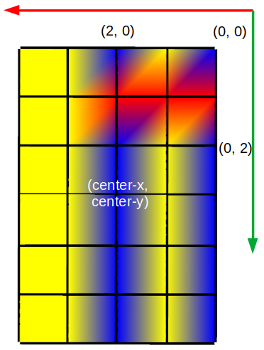
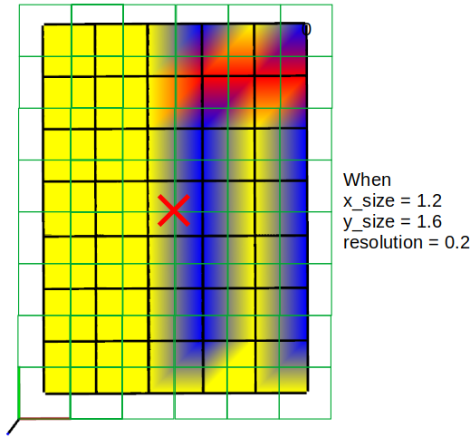

# ROS Occupancy Grid Map

## Dependencies

gridmap should be installed: http://wiki.ros.org/grid_map

## API of Occupancy grid map

Data are **discrete!!**.

data -> 0: Free
data -> 100: Occupied

## API of Occupancy grid map

Visualization is quite weird!

The each corner denotes the xy-location, so if the grid size is `w` x `h`, then `w-1` and `h-1` tiles are visualized along the X and Y directions, respectively.

